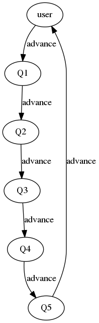

# TOC Project 2019

## Command
```sh
python app.py
```

## Finite State Machine


## Usage
The initial state is set to `user`.
Type anything will trigger  `user` to `advance` to `Q1`.
There are 5 questions to answer.
Type `1` `2` `3` `4` to answer the question,and the bot will tell you if you are right or not.
After you have answered `Q5`, the state would go back to `user` and restart again.

* user
	* Input: "hello"
* questions
	* Input: 1~4
